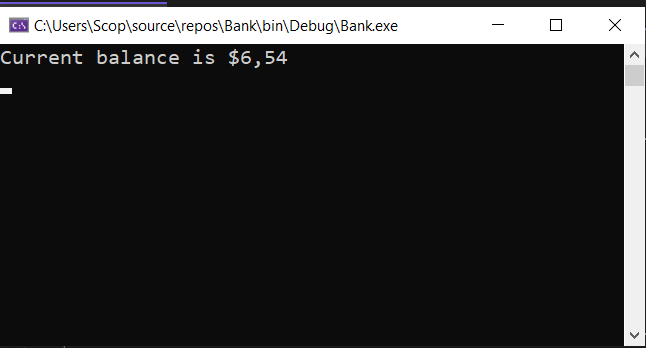
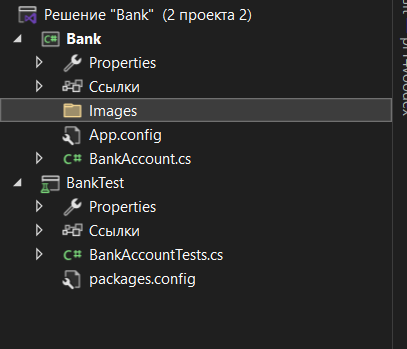

# Практическая работа №6. Создание автоматизированных Unit-тестов (Часть 1)

**Выполнили:** Зевакин Д.С. и Шпилько М.С.  
**Группа:** 3ИСИП323  
**Дата выполнения:** 04.03.2026

---

## Цель работы

Провести тестирование разработанных программных модулей с использованием средств автоматизации Microsoft Visual Studio методом "белого ящика".

---

## Описание проекта

Проект **Bank** представляет собой консольное приложение на языке C#, реализующее базовую функциональность банковского счёта. Основной класс `BankAccount` содержит методы для работы со счётом:

- **Debit(double amount)** — списание средств со счёта
- **Credit(double amount)** — зачисление средств на счёт

Для проверки корректности работы методов был создан тестовый проект **BankTests** с использованием фреймворка MSTest.

---

## Структура решения

```
Решение 'Bank'
├── Bank (основной проект)
│   ├── BankAccount.cs       - класс банковского счёта
│   └── App.config
└── BankTests (тестовый проект)
    ├── BankAccountTests.cs  - класс с unit-тестами
    └── packages.config
```

---

## Реализованный функционал

### Класс BankAccount

Класс содержит следующие элементы:

**Свойства:**
- `CustomerName` — имя владельца счёта (только для чтения)
- `Balance` — текущий баланс счёта (только для чтения)

**Методы:**
- `Debit(double amount)` — списывает указанную сумму со счёта
- `Credit(double amount)` — зачисляет указанную сумму на счёт

**Константы для сообщений об ошибках:**
- `DebitAmountExceedsBalanceMessage` — "Debit amount exceeds balance"
- `DebitAmountLessThanZeroMessage` — "Debit amount is less than zero"

**Валидация:**
- Методы проверяют корректность входных данных
- При недопустимых значениях выбрасывается исключение `ArgumentOutOfRangeException` с детальным описанием ошибки

### XML-документация

Все методы и свойства класса снабжены XML-комментариями для автоматической генерации документации и поддержки IntelliSense.

---

## Разработанные тесты

### Тесты для метода Debit

1. **Debit_WithValidAmount_UpdatesBalance**
   - **Назначение:** проверка корректного списания допустимой суммы
   - **Входные данные:** начальный баланс 11.99, списание 4.55
   - **Ожидаемый результат:** баланс 7.44

2. **Debit_WhenAmountIsLessThanZero_ShouldThrowArgumentOutOfRange**
   - **Назначение:** проверка выброса исключения при отрицательной сумме списания
   - **Входные данные:** начальный баланс 11.99, списание -100.00
   - **Ожидаемый результат:** исключение `ArgumentOutOfRangeException`

3. **Debit_WhenAmountIsMoreThanBalance_ShouldThrowArgumentOutOfRange**
   - **Назначение:** проверка выброса исключения при превышении баланса
   - **Входные данные:** начальный баланс 11.99, списание 20.0
   - **Ожидаемый результат:** исключение `ArgumentOutOfRangeException` с сообщением "Debit amount exceeds balance"

### Тесты для метода Credit

4. **Credit_WithValidAmount_UpdatesBalance**
   - **Назначение:** проверка корректного зачисления допустимой суммы
   - **Входные данные:** начальный баланс 11.99, зачисление 5.77
   - **Ожидаемый результат:** баланс 17.76

5. **Credit_WhenAmountIsLessThanZero_ShouldThrowArgumentOutOfRange**
   - **Назначение:** проверка выброса исключения при отрицательной сумме зачисления
   - **Входные данные:** начальный баланс 11.99, зачисление -100.00
   - **Ожидаемый результат:** исключение `ArgumentOutOfRangeException`

---

## Результаты тестирования

### Скриншот работы консольного приложения




---

### Скриншот обозревателя решений




---

### Скриншот обозревателя тестов


---

## Обнаруженные ошибки и их исправление

### Ошибка в методе Debit

**Описание проблемы:**  
В исходной версии кода метод `Debit` содержал логическую ошибку:

```csharp
// Неправильно - сумма добавляется вместо вычитания
m_balance += amount;
```

**Обнаружение:**  
Тест `Debit_WithValidAmount_UpdatesBalance` завершился неудачей. Ожидалось, что баланс уменьшится с 11.99 до 7.44 после списания 4.55, но вместо этого баланс увеличился до 16.54.

**Исправление:**
```csharp
// Правильно - сумма вычитается из баланса
m_balance -= amount;
```

**Результат:**  
После исправления все тесты успешно пройдены.

---

## Статистика тестирования

| Показатель | Значение |
|------------|----------|
| Всего тестов | 5 |
| Пройдено успешно | 5 ✅ |
| Провалено | 0 |
| Покрытие кода | 100% публичных методов |

---

## Выводы

1. **Эффективность модульного тестирования:** Unit-тесты позволили обнаружить критическую логическую ошибку в методе `Debit` на ранней стадии разработки, до того как код попал в продакшн.

2. **Польза XML-документации:** Документирующие комментарии улучшают читаемость кода и обеспечивают автоматическую поддержку IntelliSense при использовании классов.

3. **Качество кода:** Применение рефакторинга с использованием констант для сообщений об ошибках сделало код более поддерживаемым и тестируемым.

4. **Проверка граничных условий:** Тесты на исключения (`ArgumentOutOfRangeException`) обеспечивают корректную обработку некорректных входных данных.

5. **Автоматизация:** Использование Test Explorer в Visual Studio позволяет быстро запускать все тесты и отслеживать их статус, что значительно ускоряет процесс разработки.

6. **Методология TDD:** Разработка через тестирование (Test-Driven Development) помогает создавать более надёжный и качественный код с минимальным количеством дефектов.

---

## Используемые технологии

- **Язык программирования:** C# 
- **Платформа:** .NET Framework / .NET Core
- **IDE:** Microsoft Visual Studio 2022
- **Фреймворк тестирования:** MSTest (Microsoft.VisualStudio.TestTools.UnitTesting)
- **Методология:** Unit Testing, Test-Driven Development (TDD)

---

## Заключение

В ходе выполнения практической работы была освоена методика создания автоматизированных модульных тестов с использованием встроенных средств Visual Studio. Разработанные тесты покрывают все критические сценарии работы класса `BankAccount`, включая позитивные и негативные проверки.

Применение unit-тестирования позволило:
- Обнаружить и исправить логическую ошибку в коде
- Повысить надёжность приложения
- Создать основу для регрессионного тестирования при дальнейшей разработке
- Получить практические навыки работы с инструментами автоматизированного тестирования
